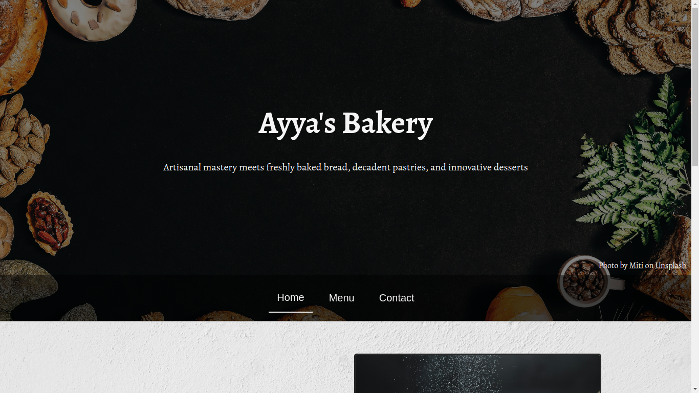

# Restaurant Landing Page

This project is a minimalist yet inviting web design aimed at showcasing a restaurant's identity and enticing potential customers. The landing page features a clean and visually appealing layout, highlighting key elements such as the restaurant's logo, high-quality images of signature dishes, and a brief description of the cuisine.

## Demo

[Live demo](https://fahryanputra.github.io/restaurant-page/)

## Built With

- HTML
- CSS
- Javascript
- Webpack

## Authors

- Github: [@fahryanputra](https://www.github.com/fahryanputra)
- Email: [fahryandi.herlasmara@gmail.com](fahryandi.herlasmara@gmail.com)

## Acknowledgements

 - [Unsplash](https://unsplash.com/)
 - [Google Font](https://fonts.google.com/)
